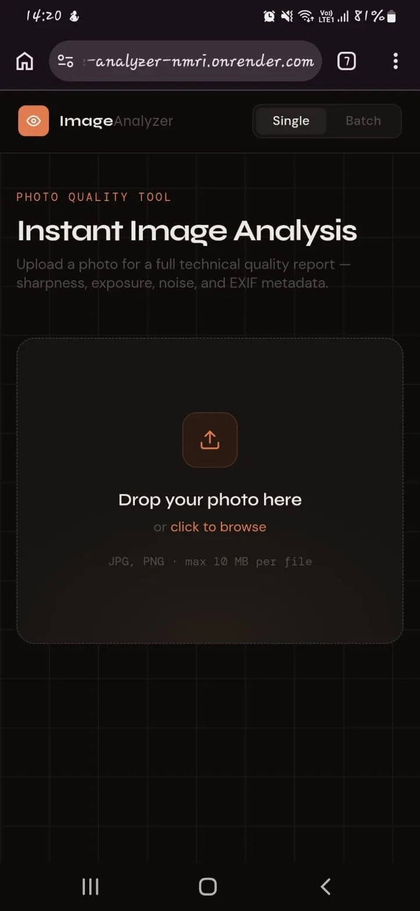
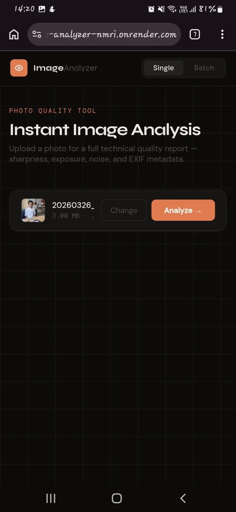
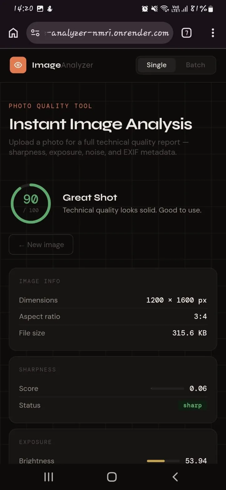
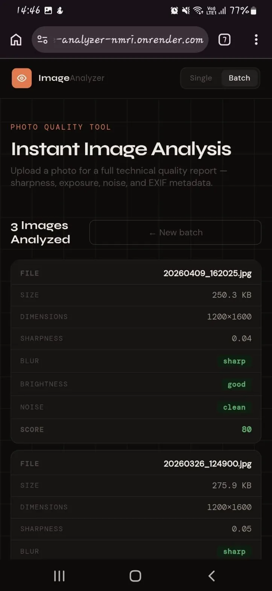

# 🔍 Image Quality Analyzer

A full-stack image analysis tool built in **Go** that performs real-time technical quality inspection — sharpness, exposure, noise, color profiling, and EXIF metadata extraction — through a clean, mobile-responsive web UI.

**Live Demo:** [image-analyzer-nmri.onrender.com](https://image-analyzer-nmri.onrender.com)

---

## Screenshots

<table>
  <tr>
    <td align="center"><b>Upload</b></td>
    <td align="center"><b>Analysis Result</b></td>
  </tr>
  <tr>
    <td></td>
    <td></td>
  </tr>
  <tr>
    <td align="center"><b>EXIF Metadata</b></td>
    <td align="center"><b>Batch Mode</b></td>
  </tr>
  <tr>
    <td></td>
    <td></td>
  </tr>
</table>

---

## What It Does

Upload any JPEG or PNG → get back a full technical quality report with an overall score, visual metrics, and camera metadata.

| Metric | Method |
|---|---|
| **Sharpness** | Laplacian variance — detects blur at pixel level |
| **Brightness** | Average luminance — flags underexposed / overexposed |
| **Noise** | Neighbor-diff Laplacian — detects high-frequency random variation |
| **Color Profile** | Dominant hue, vibrance, avg RGB |
| **EXIF Metadata** | Camera model, ISO, focal length, exposure time |

---

## Tech Stack

| Layer | Technology |
|---|---|
| **Backend** | Go (net/http) |
| **Image Processing** | `golang.org/x/image`, `goexif` |
| **EXIF (mobile)** | `exif-js` — client-side extraction before upload |
| **Frontend** | Vanilla JS, CSS Grid, SVG animations |
| **Deployment** | Render.com |

---

## Architecture

```
Browser (upload)
    │
    ├── exif-js reads EXIF from original file (before resize)
    │
    ├── Canvas resizes image if > 1600px
    │
    └── POST /analyze  { image, client_exif }
              │
              Go Server
              ├── ReadExif()       ← goexif on raw bytes
              ├── DetectBlur()     ← Laplacian variance
              ├── CheckBrightness()← avg luminance
              ├── DetectNoise()    ← neighbor diff
              └── AnalyzeColor()   ← dominant hue + vibrance
              
              (all 5 run concurrently via goroutines)
```

---

## Key Engineering Decisions

**Concurrent analysis** — all 5 analyzers run in parallel goroutines using `sync.WaitGroup`, making analysis fast even for large images.

**EXIF on mobile** — Android Chrome strips EXIF metadata during file upload (privacy feature). Fixed by reading EXIF client-side with `exif-js` before the canvas resize destroys it, then sending it as a fallback field alongside the image.

**Raw bytes preserved** — `imageData []byte` is kept separately from the decoded `image.Image`, so EXIF (which lives in the raw file bytes, not pixel data) is never lost during image decoding.

**Batch processing** — up to 20 images processed concurrently server-side, each in its own goroutine.

---

## API

### `POST /analyze`
Analyzes a single image.

**Request:** `multipart/form-data`
- `image` — JPEG or PNG file (max 10MB)
- `client_exif` — JSON string with EXIF data (optional, mobile fallback)

**Response:**
```json
{
  "file_name": "photo.jpg",
  "width": 1200, "height": 1600,
  "blur":       { "sharpness": 0.06, "status": "sharp" },
  "brightness": { "value": 53.94,   "status": "good" },
  "noise":      { "level": 0.03,    "status": "moderate" },
  "exif": {
    "camera": "samsung SM-F415F",
    "iso": "25",
    "focal_length": "5mm",
    "exposure_time": "0.02s"
  },
  "overall_score": 90
}
```

### `POST /analyze-batch`
Analyzes up to 20 images concurrently.

### `POST /export-csv`
Exports analysis results as a downloadable CSV.

---

## How to Run

```bash
git clone https://github.com/anjali-rayy/image-analyzer
cd image-analyzer
go run main.go
```

Open `http://localhost:8080` in your browser.

---

## Project Structure

```
image-analyzer/
├── main.go                  # HTTP server, routing, batch handler
├── analyzers/
│   ├── blur.go              # Laplacian sharpness detection
│   ├── brightness.go        # Luminance analysis
│   ├── noise.go             # Noise estimation
│   ├── color_profile.go     # Dominant color + vibrance
│   └── exif.go              # EXIF metadata extraction
├── static/
│   ├── index.html
│   ├── script.js            # Upload, EXIF client-side, results UI
│   └── style.css            # Dark theme, mobile-responsive
└── go.mod
```